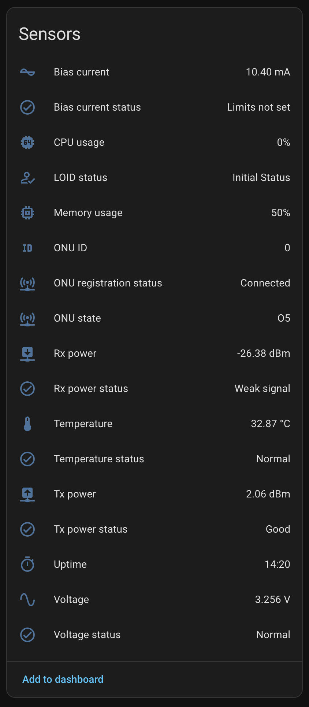
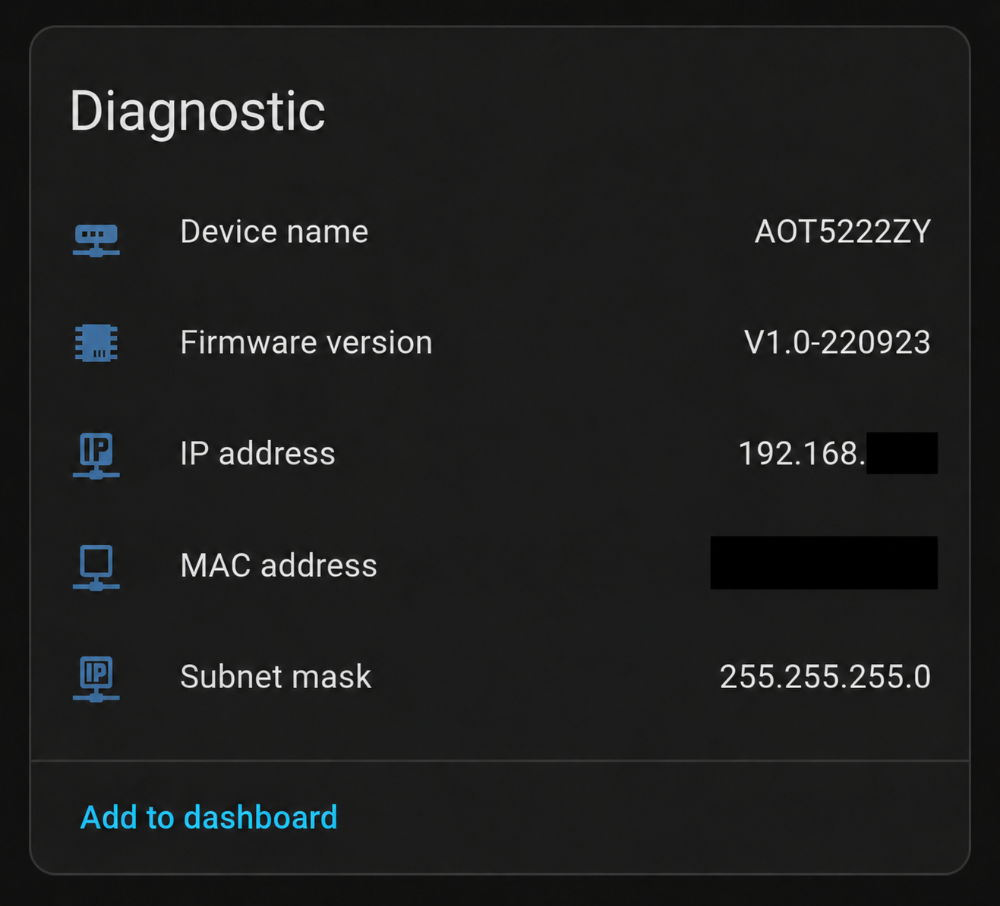
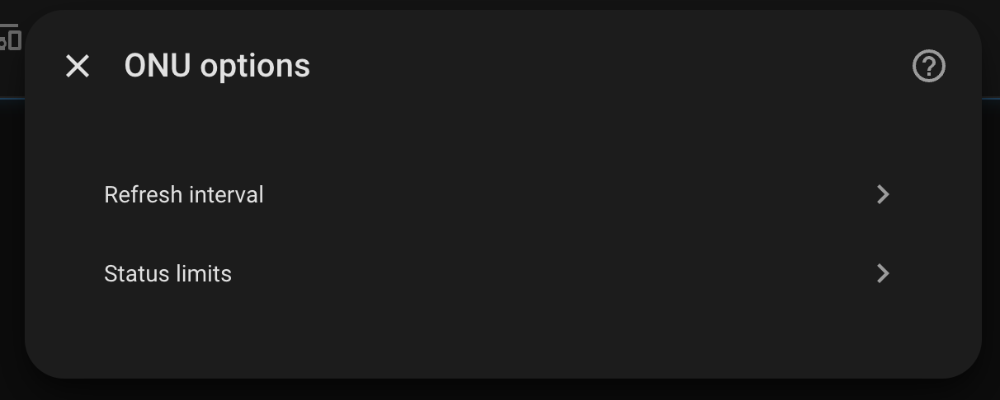
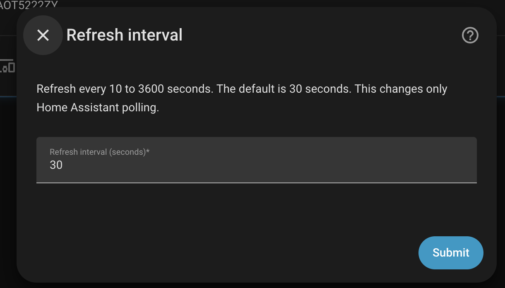
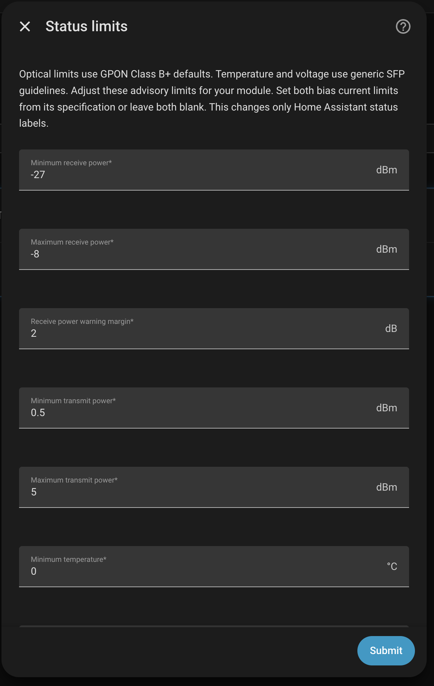
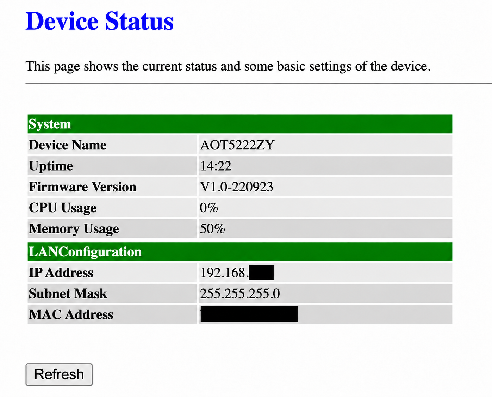
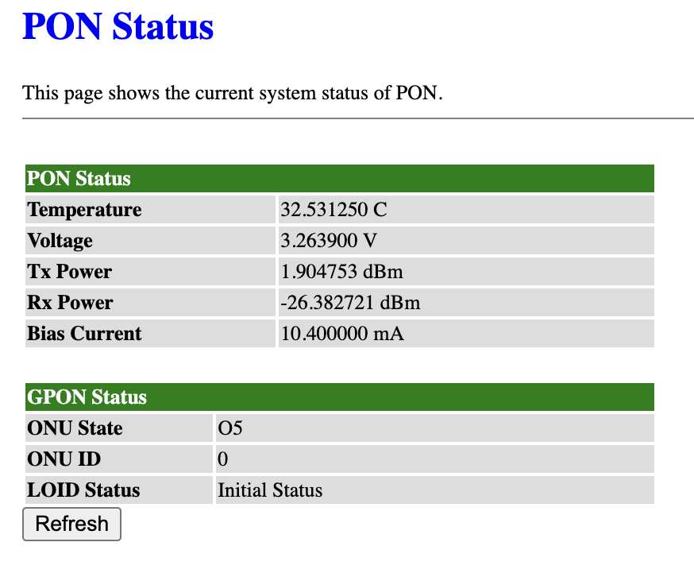

# Configure XPON ONU Stick

[Back to the README](../README.md)

## Before you start

- [Install the integration](../README.md#install) and restart Home Assistant.
- Use Home Assistant **2026.9.0 or newer**.
- Make sure Home Assistant can reach the ONU's web interface.

The integration only reads status. Screenshot IP and MAC addresses are masked for privacy.

## 1. Add the integration

1. Open **Settings → Devices & services → Add integration**.
2. Search for **XPON ONU Stick**.
3. Enter your ONU's hostname, IP address, or base URL without a page path. The address field starts blank.
4. Enter the ONU's username and password. Leave both blank if login is not required.
5. Select **Submit**.

## 2. Check the readings

- Open the device to see **22 entities**, including measurements and friendly statuses.
- **Sensors** shows PON and system readings. **Diagnostic** shows device and network information.

View sensors and diagnostics

## 3. Open the options

- Go to **Settings → Devices & services → XPON ONU Stick** and select the entry's settings gear.
- Choose **Refresh interval** or **Status limits**.

## 4. Set the refresh interval

1. Select **Refresh interval**.
2. Enter **10 to 3600 seconds**, then select **Submit**. The default is **30 seconds**.

## 5. Adjust the status limits

1. Select **Status limits**.
2. Set power, temperature, and voltage limits using your module's specifications.
3. Enter **both** bias current limits, or leave both blank for **Limits not set**.
4. Scroll to the remaining fields, then select **Submit**.

Each maximum must exceed its minimum. See [Default status limits](../README.md#default-status-limits) for all defaults and how readings are classified.

## 6. Change the address or login

1. Open the configured entry's menu and select **Reconfigure**.
2. Enter the updated address and credentials, then select **Submit**. Re-enter the password when login is required.

Changing the address preserves entities for the same stick. Add a different stick as a separate integration.

## 7. Add a dashboard

- Select **Add to dashboard** below **Sensors** or **Diagnostic**.
- Or use the [dashboard example](../examples/dashboard.yaml) in a **Manual** card and update its entity IDs.

View the ONU source status pages

**Device Status**

**PON Status**

## Troubleshooting

- **Integration missing:** check installation and restart Home Assistant.
- **Connection or login fails:** check the address, reachability from Home Assistant, and ONU credentials.
- **Entities unavailable:** both status pages must be reachable and supported.
- **Reading unknown:** the device returned an empty or unavailable value.

For a read-only connection check, see [Test the real stick](../README.md#test-the-real-stick).
